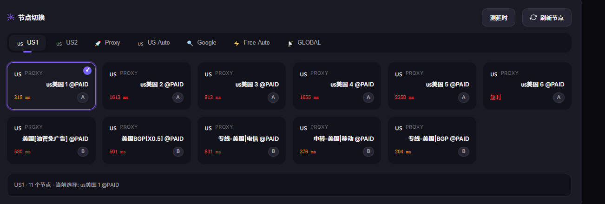
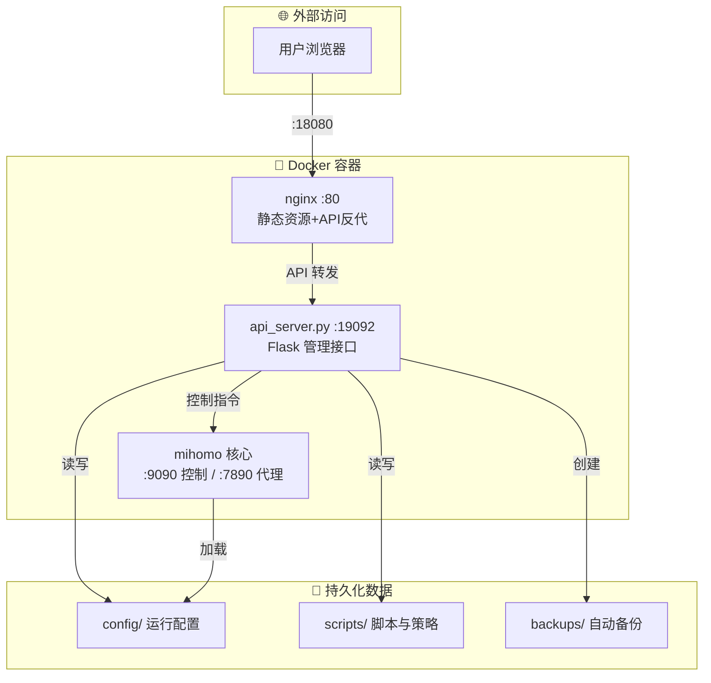

<div align="center">

# 🚀 Clash Web 管理面板

**面向内网/局域网场景的新一代 Clash 管理解决方案**

[](https://docker.com)
[](https://python.org)
[](https://vuejs.org)
[](LICENSE)

<p align="center">
  <a href="#-快速开始">快速开始</a> •
  <a href="#-核心特性">核心特性</a> •
  <a href="#-架构说明">架构说明</a> •
  <a href="#-api-文档">API 文档</a> •
  <a href="#-常见问题">常见问题</a>
</p>


</div>

---

## ✨ 核心优势

### 🎯 覆写合并订阅架构

相较于"直接改订阅原文"的传统方案，本项目采用**覆写链路**来合并订阅：

| 对比维度 | 传统方案 | 本方案 |
|---------|---------|--------|
| **职责分离** | 单一文件管理所有配置 | `template` → `site_policy` → `override.yaml` → `override.js` 分层管理 |
| **上游侵入** | 需要手工修改订阅内容 | 订阅源保持原始，零侵入 |
| **可重复性** | 难以复现相同配置 | 输入+规则 = 稳定产出 |
| **安全回滚** | 出错难以恢复 | 自动备份，一键回滚 |

> 💡 **"三段式"方案映射**
> - 🧠 **内核**: `mihomo` — 代理能力与规则执行
> - 🖥️ **前端**: `web/` + `nginx` + `api_server.py` — 管理交互与运维接口
> - 📦 **订阅集合**: `subscriptions.json` + `subscription_sets.json` — 输入组织与策略编排

---

## 📸 界面预览

<div align="center">

### 🎯 节点切换界面


*直观的节点管理，支持测延迟和快速切换*

<br>

### 📊 订阅管理面板


*Provider 状态监控 + 订阅集合管理，一站式配置中心*

</div>

---

## 🏗️ 架构说明



| 组件 | 容器内端口 | 外部映射端口 | 说明 |
|------|-----------|-------------|------|
| 🌐 Web 管理面板 | `80` | `18080` | nginx 提供静态页面 |
| 🔧 API 服务 | `19092` | `18080/api/*` | Flask 管理接口 |
| 🎯 Clash 控制 | `9090` | - | mihomo 控制接口（仅内部） |
| 🌍 HTTP 代理 | `7890` | `27890` | 混合代理端口 |
| 🧦 SOCKS5 代理 | `7891` | `27891` | SOCKS5 代理端口 |

---

## 🚀 快速开始

### 方式一：镜像部署（推荐）

**前提条件**
- ✅ Docker 与 Docker Compose 已安装
- ✅ 当前目录包含本仓库文件

```powershell
# 1️⃣ 复制环境变量模板
Copy-Item .env.example .env

# 2️⃣ 编辑 .env（至少设置 IMAGE_REF）
# IMAGE_REF=ghcr.io/<owner>/clash2web:latest

# 3️⃣ 拉取并启动
docker compose pull
docker compose up -d

# 4️⃣ 健康检查 ✅
Invoke-WebRequest http://127.0.0.1:18080/api/health
```

### 方式二：无 Docker 本地测试

```powershell
# 一键启动测试环境（自动下载 mihomo 内核）
scripts\restart_local_api_with_test_kernel.bat

# 验证接口
Invoke-WebRequest http://127.0.0.1:19092/api/health
```

### 方式三：仅重启 API（Windows）

```powershell
scripts\restart_local_api.bat
```

---

## 🎨 核心特性

### 📊 Web 管理界面
- ✅ **运行操作**: 仅合并、仅重载、合并并重载
- ✅ **订阅管理**: 新增、编辑、启停、测试、删除
- ✅ **订阅集合**: 两套表格维护（付费/免费），支持批量导入
- ✅ **节点切换**: 读取 Clash 代理组并切换当前节点
- ✅ **实时日志**: SSE 推送任务日志，实时可见

### ⚙️ 配置编辑
支持在线编辑以下文件，**保存前自动校验语法**：

| 文件 | 类型 | 校验方式 |
|------|------|----------|
| `override.js` | JavaScript | 校验 `main(config)` 可执行性 |
| `override.yaml` | YAML | 语法校验 |
| `site_policy.yaml` | YAML | 语法校验 |
| `template.yaml` | YAML | 语法校验 |
| `merge.py` | Python | 语法校验 |

> 🔒 **安全机制**: 写入前自动备份到 `config/backups/`

### 🔄 定时任务
- ⏱️ 支持间隔执行（5-1440 分钟）
- 📜 执行历史记录，支持筛选（仅 scheduler / 仅失败）
- 🔔 执行结果实时通知

### 🔧 内核在线更新
- ⬆️ 一键更新 mihomo 内核
- 🔐 SHA256 校验 + 版本验证
- ↩️ 自动回滚机制（保留 `.prev` 备份）
- 📝 更新记录持久化存储

---

## 📖 推荐使用流程

```
┌─────────────────────────────────────────────────────────────┐
│  1️⃣  订阅管理  →  维护每个订阅源，测试可用性                   │
│       ↓                                                      │
│  2️⃣  订阅集合  →  维护 set1（付费）和 set2（免费）             │
│       ↓                                                      │
│  3️⃣  覆写脚本  →  使用注入变量：SUB_SET1、SUB_SET2、...        │
│       ↓                                                      │
│  4️⃣  站点策略  →  在 site_policy.yaml 添加域名规则            │
│       ↓                                                      │
│  5️⃣  合并重载  →  点击"合并并重载"验证最终配置                 │
│       ↓                                                      │
│  6️⃣  定时任务  →  启用自动执行，解放双手                       │
└─────────────────────────────────────────────────────────────┘
```

---

## 📚 API 文档

### 🔍 健康与状态
```http
GET  /api/health              # 服务健康检查
GET  /api/status              # 系统状态
GET  /api/kernel/status       # 内核状态
GET  /api/kernel/release/latest  # 最新 release
GET  /api/kernel/updates      # 更新历史
```

### 📦 订阅管理
```http
GET    /api/subscriptions              # 获取所有订阅
POST   /api/subscriptions              # 新增订阅
PUT    /api/subscriptions/{name}       # 更新订阅
DELETE /api/subscriptions/{name}       # 删除订阅
POST   /api/subscriptions/{name}/toggle   # 切换启用状态
POST   /api/subscriptions/{name}/test     # 测试订阅
```

### ⚡ 执行操作
```http
POST /api/actions/merge              # 执行合并
POST /api/actions/reload             # 执行重载
POST /api/actions/merge-and-reload   # 合并并重载
POST /api/actions/kernel/update      # 更新内核
```

### 🎯 Clash 交互
```http
GET    /api/clash/status             # Clash 状态
GET    /api/clash/groups             # 代理组列表
POST   /api/clash/groups/{group}/select   # 切换节点
POST   /api/clash/proxies/delay      # 测延迟
```

### 📁 文件与备份
```http
GET  /api/override        / PUT  # override.yaml
GET  /api/override-script / PUT  # override.js
GET  /api/site-policy     / PUT  # site_policy.yaml
GET  /api/template        / PUT  # template.yaml
GET  /api/merge-script    / PUT  # merge.py
GET  /api/backups                 # 备份列表
DELETE /api/backups/{name}        # 删除备份
POST   /api/backups/{name}/restore   # 恢复备份
```

### 📜 日志流（SSE）
```http
GET /api/logs/stream      # 实时日志流
```

---

## 🛡️ 安全说明

| 配置项 | 说明 | 建议 |
|--------|------|------|
| `ADMIN_TOKEN` | 写操作鉴权令牌 | ✅ 务必设置强密码 |
| `CLASH_SECRET` | mihomo 控制接口密钥 | ✅ 与内核配置保持一致 |
| `CORE_UPDATE_ALLOWED_REPOS` | 允许更新的仓库白名单 | ✅ 保持最小白名单 |
| `CORE_UPDATE_REQUIRE_CHECKSUM` | 强制校验 SHA256 | ✅ 保持启用 |

> ⚠️ **公网部署警告**: 若在公网部署，请额外添加入口访问控制和 HTTPS，避免直接裸露管理面板！

---

## 📂 目录结构

```
nexent/
├── 🐳 docker-compose.yml          # 单容器部署定义
├── 🐳 compose/                    # 镜像部署目录（无需构建）
├── 🐳 Dockerfile                  # 镜像构建定义
├── 🐳 entrypoint.sh               # 初始化与启动脚本
├── 🌐 nginx.conf                  # 前端静态资源与API反代
├── 🖥️ web/                        # 管理前端（Vue.js风格）
│   ├── index.html
│   ├── app.js
│   └── style.css
├── 🐍 scripts/                    # 后端脚本
│   ├── api_server.py              # Flask 管理API
│   ├── merge.py                   # 订阅合并核心
│   ├── subscriptions.json         # 订阅源列表
│   ├── subscription_sets.json     # 订阅集合
│   ├── schedule.json              # 定时任务配置
│   ├── template.yaml              # 基础模板
│   ├── site_policy.yaml           # 站点分流策略
│   ├── override.yaml              # YAML覆写
│   └── override.js                # JS覆写脚本
└── 📁 config/                     # 运行目录（持久化卷）
    ├── config.yaml                # 运行时配置
    ├── backups/                   # 自动备份
    ├── proxies/                   # 代理配置
    ├── ruleset/                   # 规则集
    └── subs/                      # 订阅缓存
```

---

## ❓ 常见问题

<details>
<summary><b>❌ 页面能打开但操作报 <code>Unauthorized</code></b></summary>

说明已配置 `ADMIN_TOKEN`，请在页面顶部输入正确令牌后保存。
</details>

<details>
<summary><b>❌ 合并成功但切换节点失败</b></summary>

请检查 `CLASH_SECRET` 是否与运行中的 mihomo 一致。
</details>

<details>
<summary><b>❌ 订阅可访问但节点数为 0</b></summary>

可能是订阅内容不含 `proxies` 字段，或被 `include_filter` / `exclude_filter` 过滤掉。
</details>

---

## 🤝 贡献指南

1. 🍴 Fork 本仓库
2. 🌿 创建特性分支 (`git checkout -b feature/AmazingFeature`)
3. 💾 提交更改 (`git commit -m 'Add some AmazingFeature'`)
4. 📤 推送到分支 (`git push origin feature/AmazingFeature`)
5. 🔀 打开 Pull Request

---

## 📖 致谢

- **Clash 内核**: [MetaCubeX/mihomo](https://github.com/MetaCubeX/mihomo) - 核心代理引擎
- **Clash UI**: [MetaCubeX/metacubexd](https://github.com/MetaCubeX/metacubexd) - 节点切换界面

---

<div align="center">

**Made with ❤️ for the Clash Community**

[⭐ Star this repo](https://github.com/your-repo/clash-web) · [🐛 Report Bug](https://github.com/your-repo/clash-web/issues) · [💡 Request Feature](https://github.com/your-repo/clash-web/issues)

</div>
